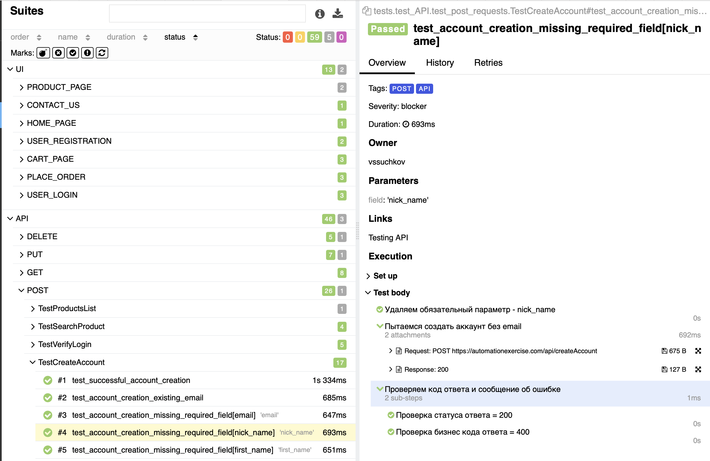

# Проект по автоматизации Automation Exercise

##  Содержание:

> ➠ [Технологический стек](#технологический-стек)
>
> ➠ [Покрытый функционал](#покрытый-функционал)
>
> ➠ [Сборка в Jenkins](#Jenkins-job)
>
> ➠ [Allure отчет](#Allure-отчет)
> 
> ➠ [AllureTO отчет](#AllureTO-отчет)
> 
> ➠ [Интеграция с Jira](#JIRA-интеграция)
>
> ➠ [Отчет в Telegram](#Telegram-оповещение)
>
> ➠ [Видео примеры прохождения тестов](#Пример-test-ui)

  
## 🧰 
Технологии и инструменты

  

В данном проекте представлены:  

- автотесты API, расположенные в дирректории <code>./tests/test_API</code>;
- автотесты UI, с использованием библиотеки <code>Selene</code>, расположены в  <code>./tests/test_UI</code>.

Для работы с виртуальным окружением и зависимостями, используется <code>Poetry</code>

#### UI тесты реализованы паттерном PageObject
>
> <code>Selenoid</code> выполняет запуск браузера в контейнере <code>Docker</code>.
>
> <code>Allure Report/Allure TestOps</code> формируют отчеты о запуске тестов.
>
> <code>Jenkins</code> выполняет запуск тестов.
> После завершения прогона отправляются уведомления с помощью бота в <code>Telegram</code>.

## 
Покрытый функционал

> Разработаны автотесты для <code>UI</code> и <code>API</code>.

<h2 align="center"> UI тесты</h2>

- [x] Тестирование регистрации пользователя
- [x] Тестирование авторизации пользователя
- [x] Тестирование добавления товара в корзину
- [x] Тестирование добавления товара в корзину с последующей авторизацией
- [x] Тестирование добавления товара в корзину с последующей регистрацией
- [x] Тестирование оформления заказа
- [x] Тестирование заполнения и отправки формы обратной связи
- [x] Тестирование оформления подписки на главной странице 

<h2 align="center"> API тесты</h2>

- **Тестирование запросов GET**
  - [x] `all_products`
  - [x] `all_brands`
  - [x] `user_account_detail`

- **Тестирование запросов POST**
  - [x] `test_search_product`
  - [x] `verify_login`
  - [x] `create_account`

- **Тестирование запросов DELETE**
  - [x] `userAccount`

### Функционал в разработке

Разрабатываемый функционал - помечен маркером <code>pytest.mark.xfail/skip</code> или <code>pytest.mark.skip</code>
с указанием причины

## </a> Jenkins <a target="_blank" href="https://jenkins.autotests.cloud/job/Johnnie_Walker_UI_tests/"> job </a>

# Примеры использования

###  Основной Allure отчет

### Тесты 

## </a> Отчет в <a target="_blank" href="https://allure.autotests.cloud/launch/48029">Allure TestOps</a>

## </a> Интеграция с <a target="_blank" href="https://jira.autotests.cloud/browse/HOMEWORK-1492">Jira</a>

## </a> Уведомление в Telegram при помощи бота
> После завершения сборки специальный бот, созданный в <code>Telegram</code>, автоматически обрабатывает и отправляет сообщение с отчетом о прогоне.

## Пример запуска тестов в Selenoid
### Добавление товара в корзину с последующей регистрацией

