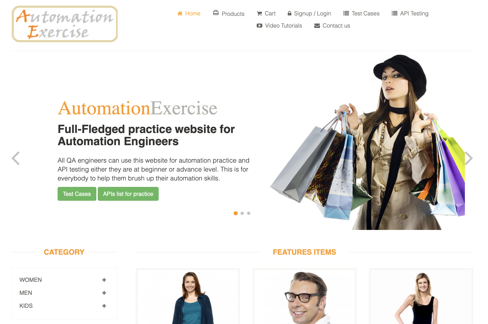
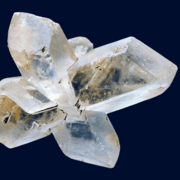
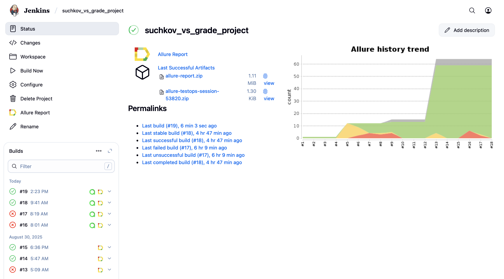
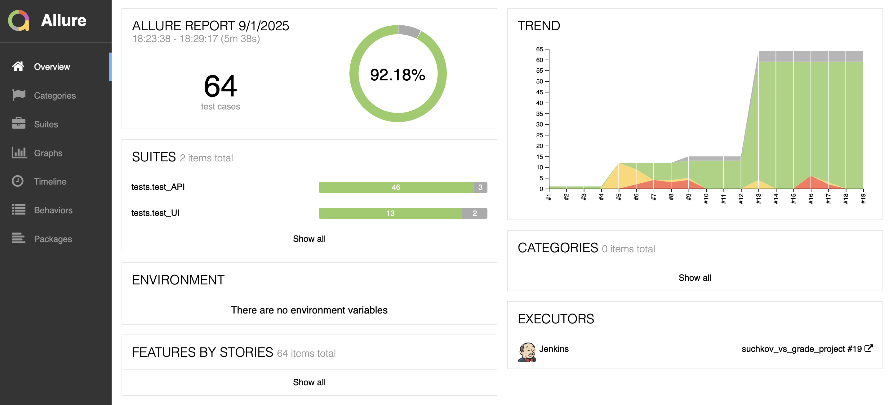
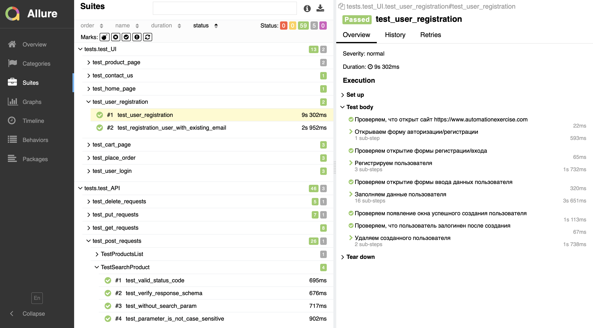
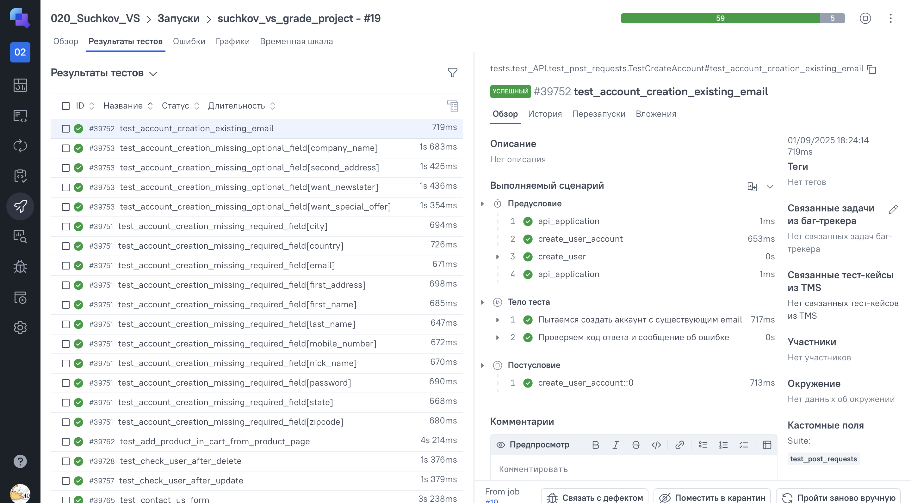
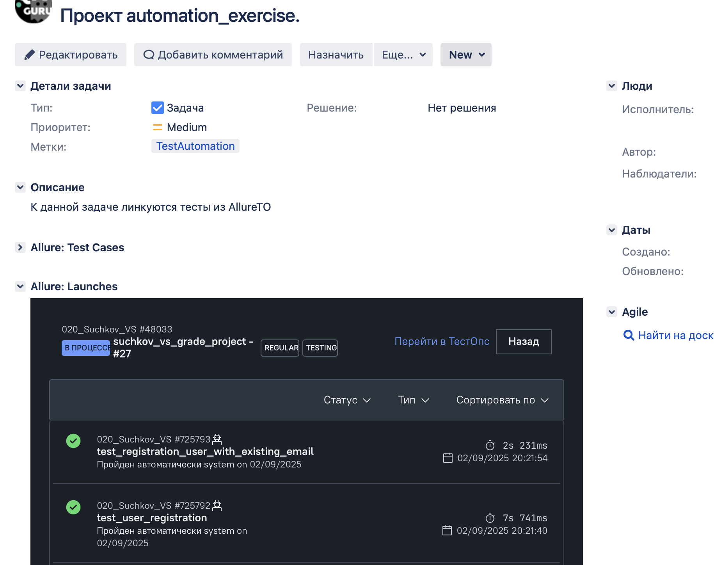
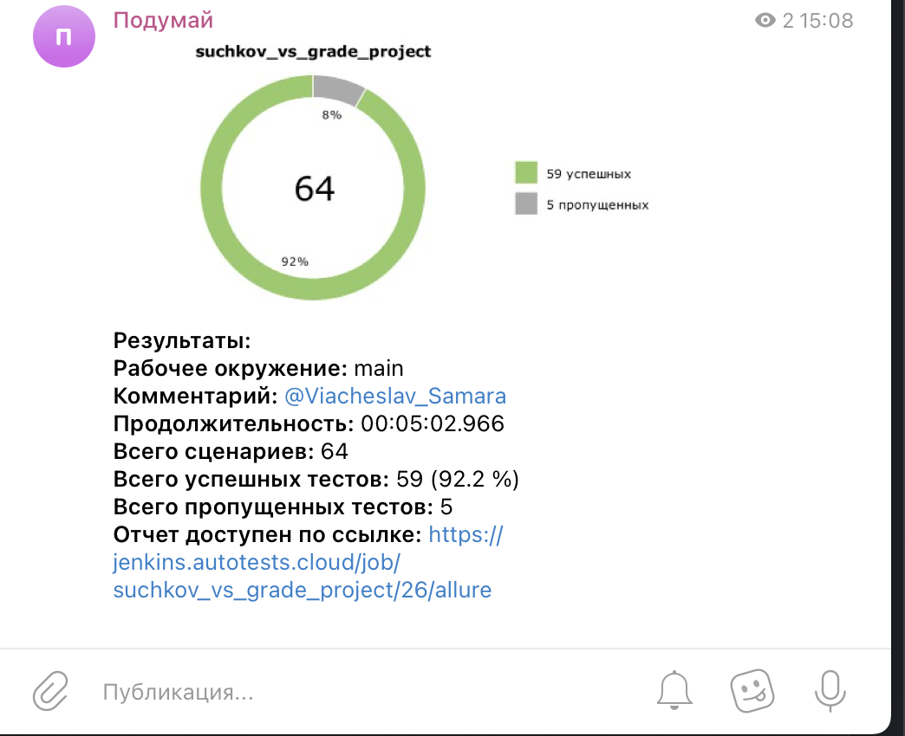
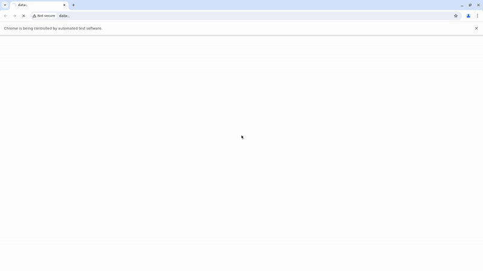

# Демо проект по автоматизации Automation Exercise

##  Содержание:

> ➠ [Технологический стек](#classical_building-технологический-стек)
>
> ➠ [Покрытый функционал](#earth_africa-покрытый-функционал)
>
> ➠ [Сборка в Jenkins](#earth_africa-Jenkins-job)
>
> ➠ [Allure отчет](#earth_africa-Allure-отчет)
> 
> ➠ [Интеграция с Jira](#earth_africa-Allure-отчет)
>
> ➠ [Отчет в Telegram](#earth_africa-Уведомление-в-Telegram-при-помощи-бота)
>
> ➠ [Видео примеры прохождения тестов](#earth_africa-Примеры-видео-о-прохождении-тестов)

  
## 🧰 Технологии и инструменты

  
  

В данном проекте представлены:  

- автотесты API, расположенные в дирректории <code>./tests/test_API</code>;
- автотесты UI, с использованием библиотеки <code>Selene</code>, расположены в  <code>./tests/test_UI</code>.

#### UI тесты реализованы паттерном PageObject
>
> <code>Selenoid</code> выполняет запуск браузера в контейнере <code>Docker</code>.
>
> <code>Allure Report/Allure TestOps</code> формируют отчеты о запуске тестов.
>
> <code>Jenkins</code> выполняет запуск тестов.
> После завершения прогона отправляются уведомления с помощью бота в <code>Telegram</code>.

## Покрытый функционал

> Автотесты для <code>UI</code> и <code>API</code>.
### UI
- [x] Тестирование регистрации пользователя
- [x] Тестирование авторизации пользователя
- [x] Тестирование добавления товара в корзину
- [x] Тестирование добавления товара в корзину с последующей авторизацией
- [x] Тестирование добавления товара в корзину с последующей регистрацией
- [x] Тестирование оформления заказа
- [x] Тестирование заполнения и отправки формы обратной связи
- [x] Тестирование оформления подписки на главной странице 

### API
- [x] Тестирование запросов GET (all_products, all_brands, user_account_detail)
- [x] Тестирование запросов POST (test_search_product, verify_login, create_account)
- [x] Тестирование запросов DELETE (userAccount)

### Функционал в разработке помечен маркерами <code>pytest.mark.xfail/skip</code>

## </a> Jenkins <a target="_blank" href="https://jenkins.autotests.cloud/job/Johnnie_Walker_UI_tests/"> job </a>

# Примеры использования

###  Основной отчет

### Тесты 

## </a> Отчет в <a target="_blank" href="https://allure.autotests.cloud/launch/48029">Allure TestOps</a>

## </a> Интеграция с <a target="_blank" href="https://jira.autotests.cloud/browse/HOMEWORK-1492">Jira</a>

## </a> Уведомление в Telegram при помощи бота
> После завершения сборки специальный бот, созданный в <code>Telegram</code>, автоматически обрабатывает и отправляет сообщение с отчетом о прогоне.

## Пример запуска тестов в Selenoid
### Добавление товара в корзину с последующей регистрацией

